# Hi there, I’m Wayy 👋
### Developer for fun

Welcome! I’m a hobby developer who enjoys building and experimenting with code.

## 🧰 Tech stack
- TypeScript · JavaScript · Go
- Docker & tooling

## 🔭 Featured repositories
- [Notes-app-react-NOT-Finished](https://github.com/Wayy01/Notes-app-react-NOT-Finished)
- [Roslin-redesign-ui](https://github.com/Wayy01/Roslin-redesign-ui)
- [docker-manager](https://github.com/Wayy01/docker-manager)
- [Vibe-Coded-Altnet](https://github.com/Wayy01/Vibe-Coded-Altnet)
- [Libre-translate-open-source](https://github.com/Wayy01/Libre-translate-open-source)
- [lan-ruso](https://github.com/Wayy01/lan-ruso)

## 📊 GitHub stats

## 🤝 Connect
- Instagram: [@ion191_](https://www.instagram.com/ion191_/)

## ⚡ Fun fact
I debug, therefore I am 😄
