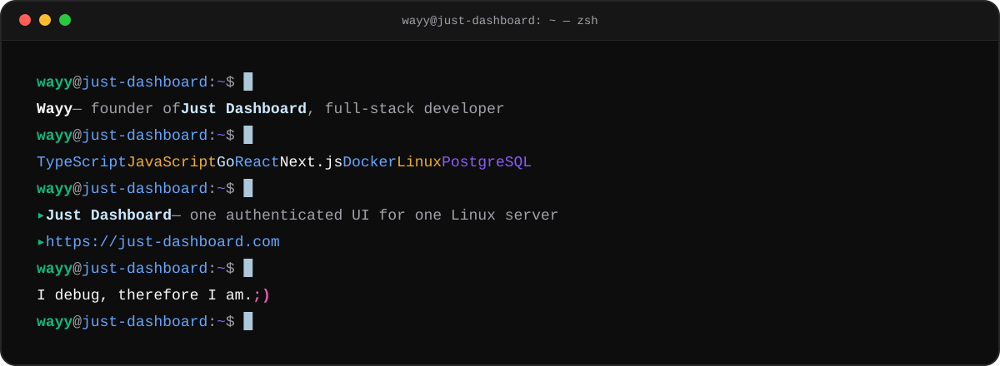

<div align="center">

<a href="https://just-dashboard.com">
  
</a>

<p>
  <a href="https://just-dashboard.com"></a>
  <a href="https://github.com/JustDashboard/Just-Dashboard"></a>
  <a href="https://buymeacoffee.com/ionmoisei72"></a>
  <a href="https://github.com/Wayy01?tab=followers"></a>
</p>

</div>

## 👋 About me



I'm **Wayy**, a full-stack developer and the **founder of [Just Dashboard](https://just-dashboard.com)**. I like building tools that answer the next question instead of just showing a number, and I learn best by shipping real products.

- 🚀 Founder and builder of **Just Dashboard**, one authenticated UI for one Linux server
- 🔧 I love solving complex problems with elegant solutions
- ✨ I care about clean, maintainable code and a great user experience
- 📚 Always learning and keeping up with what's new in tech
- 🤝 Open to exciting projects and collaborations
- ⚡ Fun fact: I debug, therefore I am 😄

## 🚀 Founder of Just Dashboard

<a href="https://just-dashboard.com">
  
</a>

**[Just Dashboard](https://just-dashboard.com)** puts metrics, Docker, processes, logs, a real shell, files, git, databases, the reverse proxy, the firewall, backups and deploys into one UI for one Linux server. It sits behind a login that lives on your private network. It's free, and every feature stays free.

<table>
  <tr>
    <td width="50%">🚢 <b>Deploys from anything</b><br/><sub>A repository, an image, a template or a Compose file. Releases are immutable, so a rollback brings back what ran before.</sub></td>
    <td width="50%">🗄️ <b>Databases you can hand out</b><br/><sub>Browse, query and diagram several engines from one place. A database started here gets its own connection string.</sub></td>
  </tr>
  <tr>
    <td>🧩 <b>Reviewed one-click templates</b><br/><sub>PostgreSQL, Redis, n8n, Grafana, Uptime Kuma, Ollama and more. Each one says how you sign in.</sub></td>
    <td>🔁 <b>Push to deploy, with previews</b><br/><sub>Pull-request previews and notifications to Discord, Slack, Telegram, e-mail and webhooks.</sub></td>
  </tr>
  <tr>
    <td>💾 <b>Backups that know the gaps</b><br/><sub>Every volume, stack, deployment and database, plus a list of what isn't backed up yet.</sub></td>
    <td>🔐 <b>Private by default</b><br/><sub>Built for Tailscale or an SSH tunnel, with two-factor sign-in and an audit log of every change.</sub></td>
  </tr>
</table>

```bash
# Try it on your own server
git clone https://github.com/JustDashboard/Just-Dashboard.git
cd Just-Dashboard && sudo ./install.sh
```

<p align="center">
  <a href="https://just-dashboard.com"><b>🌐 just-dashboard.com</b></a> &nbsp;·&nbsp;
  <a href="https://github.com/JustDashboard/Just-Dashboard"><b>⭐ Star it on GitHub</b></a> &nbsp;·&nbsp;
  <a href="https://buymeacoffee.com/ionmoisei72"><b>☕ Support the project</b></a>
</p>

## 🛠️ Tech stack

<p align="center">
  <a href="https://skillicons.dev">
    
  </a>
</p>

## 📊 GitHub stats

<p align="center">
  
</p>

## ☕ Support my work

Just Dashboard is free, and every feature stays free. If it has saved you an evening, you can buy me a coffee. It's entirely optional. 💛

<p align="center">
  <a href="https://buymeacoffee.com/ionmoisei72">
    
  </a>
</p>

Want to **sponsor Just Dashboard**? Write to [ionmoisei755@gmail.com](mailto:ionmoisei755@gmail.com) and you'll be listed in the project with a logo and a link.

## 🤝 Let's connect

<p align="center">
  <a href="https://just-dashboard.com"></a>
  <a href="https://github.com/Wayy01"></a>
  <a href="https://github.com/JustDashboard"></a>
  <a href="https://www.instagram.com/ion191_/"></a>
  <a href="mailto:ionmoisei755@gmail.com"></a>
</p>

<p align="center"><sub>Thanks for stopping by! Made with 💙 by Wayy, founder of <a href="https://just-dashboard.com">Just Dashboard</a>.</sub></p>


